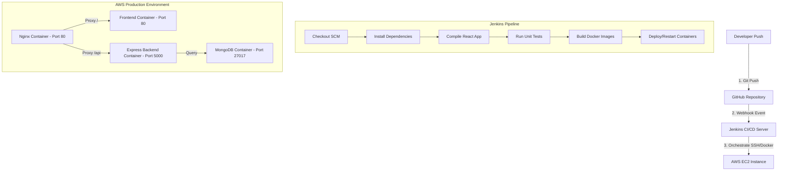

# 🚀 DevOps & Cloud Deployment Manual: Jenkins & AWS EC2

This guide is designed for developers, administrators, and reviewers (including your teacher) to verify, audit, and run the automated CI/CD pipeline and AWS cloud deployment for the **Student Management System**.

---

## 🏛️ Deployment Architecture Overview



---

## ☁️ Section 1: AWS EC2 Server Setup Guide

To deploy the production-ready application container ecosystem on AWS:

### 1. Launch EC2 Instance
* **AMI**: Ubuntu Server 22.04 LTS or 24.04 LTS (64-bit).
* **Instance Type**: `t2.medium` (recommended minimum to support running both Jenkins and Docker concurrently) or `t2.micro` (if hosting Jenkins externally).
* **Key Pair**: Create or use an existing `.pem` private key for secure SSH terminal access.

### 2. Configure AWS Security Groups
You must configure the Security Group inbound rules to permit access to the services:

| Port Range | Protocol | Source | Purpose |
|---|---|---|---|
| `22` | TCP | `My IP` or `0.0.0.0/0` | Secure SSH Administration |
| `80` | TCP | `0.0.0.0/0` | Public Web Traffic (HTTP / Nginx Proxy) |
| `443` | TCP | `0.0.0.0/0` | Secure Web Traffic (HTTPS / SSL) |
| `8080` | TCP | `0.0.0.0/0` (or GitHub IPs) | Jenkins Dashboard & GitHub Webhook Listener |

### 3. Provision the EC2 Server
Connect to your instance via SSH:
```bash
ssh -i "your-key.pem" ubuntu@your-ec2-public-ip
```

Update system software and install Docker + Docker Compose:
```bash
# Update repository lists
sudo apt update && sudo apt upgrade -y

# Install Docker
sudo apt install -y docker.io
sudo systemctl enable --now docker

# Add Ubuntu user to Docker group (removes sudo requirement for docker commands)
sudo usermod -aG docker ubuntu
newgrp docker

# Install Docker Compose v2
sudo apt install -y docker-compose-plugin
```

---

## 🏗️ Section 2: Jenkins CI/CD Pipeline Configuration

This section details how to configure Jenkins to run your `Jenkinsfile` and automate builds on every repository update.

### 1. Install Jenkins on the EC2 Server
If hosting Jenkins on the same server, install Java and Jenkins:
```bash
sudo apt install -y openjdk-17-jre

# Add Jenkins repository and install
curl -fsSL https://pkg.jenkins.io/debian-stable/jenkins.io-2023.key | sudo tee \
  /usr/share/keyrings/jenkins-keyring.asc > /dev/null
echo deb [signed-by=/usr/share/keyrings/jenkins-keyring.asc] \
  https://pkg.jenkins.io/debian-stable binary/ | sudo tee \
  /etc/default/jenkins > /dev/null
sudo apt update
sudo apt install -y jenkins

# Enable and start Jenkins service
sudo systemctl enable --now jenkins
```
*Locate the unlock key at:* `sudo cat /var/lib/jenkins/secrets/initialAdminPassword`

### 2. Configure Jenkins Credentials
Navigate to **Jenkins Dashboard** -> **Manage Jenkins** -> **Credentials**:
* **Git Private Key (`git-repo-key`)**: Add an SSH Private Key to allow Jenkins to clone private repository updates.
* **Docker Hub Login (`dockerhub-creds`)**: Username and Password credentials for publishing container images to a registry (if applicable).

### 3. Register GitHub Webhook
To automate build triggering on Git pushes:
1. Open your repository on GitHub.
2. Go to **Settings** -> **Webhooks** -> **Add webhook**.
3. **Payload URL**: `http://<YOUR-EC2-PUBLIC-IP>:8080/github-webhook/`
4. **Content-Type**: `application/json`
5. **Which events**: Select *Just the push event*.

### 4. Create the Declarative Pipeline Job
1. From the Jenkins sidebar, click **New Item**.
2. **Name**: `student-management-system-pipeline`
3. **Type**: Select **Pipeline** and click OK.
4. Under **Build Triggers**, tick **GitHub hook trigger for GITScm polling**.
5. Under **Pipeline**:
   * **Definition**: Select *Pipeline script from SCM*.
   * **SCM**: Select *Git*.
   * **Repository URL**: Paste your repository URL (SSH format is standard for pipelines).
   * **Credentials**: Choose your registered Git credential key.
   * **Branch Specifier**: `*/main`
   * **Script Path**: `Jenkinsfile`
6. Click **Save**.

---

## 🔒 Section 3: SSL Setup & Domain Mapping (Production-Grade)

To secure the EC2 site under HTTPS with SSL certificates:

1. **Map Domain**: Configure your domain's DNS panel (Route 53, Cloudflare, Namecheap, etc.) to point an `A Record` to your EC2's Public IP.
2. **Install Certbot**:
   ```bash
   sudo apt install -y certbot python3-certbot-nginx
   ```
3. **Acquire Certificate**:
   ```bash
   sudo certbot --nginx -d yourdomain.com
   ```
   *Certbot will automatically verify ownership, fetch an SSL certificate from Let's Encrypt, and update the Nginx configuration to force secure HTTPS connections.*

---

## 👨‍🏫 Section 4: Teacher's Assessment Checklist

Here is a checklist your teacher can use to audit and evaluate your full-stack cloud implementation:

### 1. Source Code Repository Audit
- [ ] Presence of standard **MVC** folder structure under `/server` (routes, models, controllers, middleware, config).
- [ ] A multi-stage optimized [Dockerfile](file:///d:/PEP_Project/client/Dockerfile) in the React directory.
- [ ] A lightweight microservice [Dockerfile](file:///d:/PEP_Project/server/Dockerfile) in the Express directory.
- [ ] A root [docker-compose.yml](file:///d:/PEP_Project/docker-compose.yml) linking the containers, setting ports, and deploying a local Mongo DB volumes cluster.
- [ ] A root [Jenkinsfile](file:///d:/PEP_Project/Jenkinsfile) containing declarative pipeline stages.
- [ ] A [.github/workflows/deploy.yml](file:///d:/PEP_Project/.github/workflows/deploy.yml) file running check-suites on pull request merges.

### 2. Jenkins pipeline Audit
- [ ] Login to Jenkins dashboard `http://<YOUR-EC2-PUBLIC-IP>:8080`.
- [ ] Review build triggers on Git commits (automated webhooks).
- [ ] Check pipeline execution logs to confirm all stages (Checkout, Dependencies installation, Compile, Tests, Docker build, Deploy) succeeded.

### 3. AWS Running Instance Verification
- [ ] Visit `http://<YOUR-EC2-PUBLIC-IP>` (or domain name).
- [ ] Test the **JWT Admin Auth Login** (`admin@example.com` / `SecureAdmin123!`).
- [ ] Perform a full CRUD flow (Create, Read, Update, Delete) to confirm Mongoose routes write successfully to the database.
- [ ] Inspect the live dashboard stats counter, proving the stats dynamically fetch database entries correctly.
